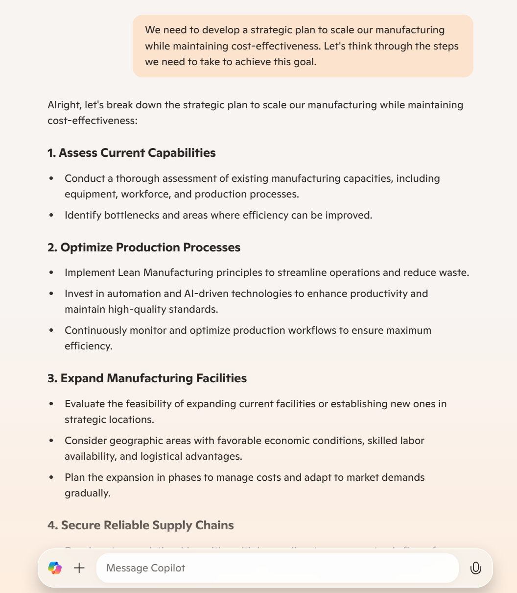

<div class="section" markdown="1">

Lab created by
<ul style="list-style-type: none; padding: 0; margin: 0;">
    <li>Florian Follonier - Cloud Solution Architect Data & AI - Microsoft</li>
    <li>Juan Manuel Servera - Cloud Solution Architect App Innovation - Microsoft</li>
</ul>

## Introduction

<div class="step" markdown="1">


**Welcome to the Advanced Prompt Engineering Lab**

This guide will walk you through a series of steps designed to teach advanced techniques for crafting highly effective prompts. The exercises are tailored for participants with prior experience working with Large Language Models (LLMs) who are eager to elevate their prompt engineering skills.

Our goal is to enhance your ability to use AI tools effectively, empowering you to achieve more with each interaction.

This lab has been developed and tested with Microsoft Copilot but may also be compatible with other AI assistants.

### What Awaits You in This Lab?

In this lab, you will follow a guided journey to create a startup plan using sophisticated prompt engineering methods.

**Lab Overview:**

- [Exercise 1]({{ basename }}#exercise-1): Getting Familiar with Microsoft Copilot and Zero-Shot Prompting
- [Exercise 2]({{ basename }}#exercise-2): In-Context Learning and Setting Goals with Task-Specific Prompting
- [Exercise 3]({{ basename }}#exercise-3): Refining Responses with Recursive Prompting and Task Splitting
- [Exercise 4]({{ basename }}#exercise-4): Enhancing Reasoning with Chain-of-Thought and Tree-of-Thought Prompting
- [Exercise 5]({{ basename }}#exercise-5): Generating Structured Outputs and Visualizations with Advanced Techniques
- [Exercise 6]({{ basename }}#exercise-6): Classifying Text with Zero-Shot and Few-Shot Sentiment Analysis

Let’s get started by setting the foundation for our startup journey!

</div>
</div>

<div class="section" markdown="1"> <!-- section: Exercise 1 -->

## Exercise 1 – Getting familiar with Microsoft Copilot {#exercise-1}

<div class="step" markdown="1">

### Objective

In this exercise, you'll become acquainted with Microsoft Copilot and practice zero-shot prompting by initiating a SWOT analysis for your startup.

</div>

<div class="step" markdown="1">

### Step 1: Setting Up Microsoft Copilot

For this exercise, we’ll be using **Microsoft Copilot** —your go-to AI companion for web-based AI-powered chat. 

Two options how to access Copilot:

- **You have a work account with a Copilot License:**<br>
        In this case, you can use Copilot via 
        [bing.com/chat](https://www.bing.com/chat), ensure you configure the assistant for *WEB* and not for *WORK*. It will look similar to:
        
        
- **You don't have a work account with a Copilot License:**<br>
        In this case, use Copilot via [copilot.microsoft.com](https://copilot.microsoft.com/). In this case, ensure that:
        
    - You log in with a [Microsoft account](https://account.microsoft.com/account/CreateAccount) (@outlook @hotmail @live or similar)
    - You use the [Edge Browser](https://www.microsoft.com/edge/download). It will look similar to:


*Note:* If you’re accessing this exercise on a mobile browser, you might encounter a different interface. In that case, you may be prompted to log in with your Microsoft account to proceed.

> **Important:** This exercise builds on foundational prompt engineering concepts. If you’re new to prompt engineering, we recommend starting with the [entry-level tutorial](https://jmservera.github.io/miscdemos/prompt-engineering#exercise-1--warmup-with-basic-prompts) to familiarize yourself with the basics before moving on to advanced techniques.

Next, we’ll dive into brainstorming and strategic planning for EcoGen Solutions. Your tasks will include defining the company’s strengths and weaknesses, identifying opportunities in a growing market, and anticipating potential threats. 

We're diving into an ideation session today, and as Linus Pauling once said:

> *The best way to have a good idea is to have lots of ideas.*

</div>


<div class="step" markdown="1">

### Step 2: Initiating a SWOT Analysis with Zero-Shot Prompting

Let's begin with **Zero-shot prompting**. 

Zero-shot prompting involves giving the AI a broad prompt without specific examples, allowing it to generate open-ended responses.<br><br>

**Imagine...**<br><br>
You're the CEO of a EcoVerse Solutions - a leading company for Co2 storage.

Your mission is to lead strategic growth while ensuring innovation. 
Alongside you is an AI-driven executive assistant that you can prompt to tackle this task.


```prompt
As the founder of EcoVerse Solutions, I need to understand the current market landscape. Please provide a SWOT analysis for my company, considering the renewable energy sector.

Information About EcoVerse Solutions: EcoVerse Solutions, a leading innovator in direct air capture (DAC) technology, has established itself as a key player in the fight against climate change by developing advanced systems to capture CO₂ directly from the atmosphere. Backed by strategic partnerships with major corporations like Microsoft and strong financial support, the company is poised for growth. However, EcoVerse Solutions faces challenges in scaling its operations and reducing the high costs associated with capturing carbon, which limits broader adoption. As global policies shift towards net-zero goals, the company has significant opportunities to benefit from government regulations and the growing carbon credits market. Nonetheless, emerging competition in the DAC space and potential economic fluctuations pose risks to its future expansion.
```

> This **zero-shot prompt** sets the context and assigns roles without providing specific examples.

**Expected Outcome**

Copilot should provide a basic SWOT analysis outlining potential strengths, weaknesses, opportunities, and threats for EcoVerse Solutions.


</div>
</div> <!-- end section: Exercise 1 -->

<div class="section" markdown="1"> <!-- section: Exercise 2 -->

## Exercise 2 – In-Context Learning and Setting Goals with Task-Specific Prompting {#exercise-2}

<div class="step" markdown="1">

### Objective

Next, let's enhance the AI's responses by providing additional context and setting goals. For this, we use **in-context learning** and **task-specific prompting**.

</div>

<div class="step" markdown="1">

### Step 1: Define Your Startup Persona

In-context learning provides the AI with specific information within the prompt to guide its response.<br><br>

**Scenario**.

You are the CEO of EcoVerse Solutions. Your mission is to lead strategic growth while ensuring innovation in renewable energy. <br><br>

```prompt
I am the new CEO of EcoVerse Solutions. I have recently joined the company and now need to tackle various challenges. 

You are assuming the role of an experienced business strategist with a background in renewable energy, particularly skilled in scaling operations, optimizing sustainability practices, and navigating industry regulations. My immediate goals are to build strong partnerships, secure funding, and establish a competitive market position while addressing operational challenges like cost-efficiency and technology adoption. I seek your expertise in developing strategic initiatives, identifying growth opportunities, and overcoming potential obstacles as we work towards making EcoVerse a leader in sustainable innovation.

Assist me with a series of tasks that I will provide to you next. Just reply with "Ok".

```
<br>
This prompt provides context, setting roles and background information to guide the AI's response more effectively without triggering an immediate response.

**Expected Outcome**
"Ok"

</div>

<div class="step" markdown="1">

### Step 2: Setting Goals with Task-Specific Prompting

Task-specific prompting focuses the AI's output on desired deliverables.

Why Identify Your Goals?
Clearly outlining your goals serves multiple purposes:

Use the following questions to comprehensively define the goals of your project:

What is the problem you are solving or the goal that you are trying to achieve?
Why do you need to solve this problem?
Who is the stakeholder/end-user of the solution?
How does the solution impact them?
Where is your data stored and where will the solution be hosted?
When does it need to be ready?

```prompt
Please help me create an outline for a 10-slide presentation targeted at potential investors. The objective is to effectively communicate our mission to become the leading provider of affordable, high-efficiency solar panels. After the presentation, I want the investors to be excited and inspired to invest in my company. Additional requirements:

Use simple language.
Catchy slide titles.
Clear call to action at the end.
Present the outline in bullet points.
```
<br>
**Expected Outcome** <br> <br> 
<p>Copilot should generate a structured presentation outline that meets the specified requirements, demonstrating how providing clear goals and context improves the quality of the AI's output.</p>

</div>
</div><!-- end section: Exercise 2 -->

<div class="section" markdown="1"> <!-- section: Exercise 3 -->

## Exercise 3 – Refining Responses with Recursive Prompting and Task Splitting {#exercise-3}

<div class="step" markdown="1">

### Objective

Learn how to refine AI responses through recursive prompting and improve task handling by splitting complex tasks into subtasks.

</div>

<div class="step" markdown="1">

### Step 1: Recursive Prompting – Anticipating Investor Questions

Recursive prompting involves using follow-up prompts to refine the AI's output. <br> <br>

**Initial prompt**
```
Based on the presentation outline, put yourself in the shoes of skeptical investors and think about 10 critical questions they might ask during the presentation. Be creative and extra critical. 
```

**First follow-Up prompt**
```
For each question, please provide a well-thought-out answer.
```
**Second follow-Up prompt**
```
Please present the results in a table with two columns: "Question" and "Answer".
```
<br>

**Expected Outcome**

Copilot should generate a table with critical investor questions and corresponding answers, demonstrating how recursive prompts can refine and expand the AI's responses. 

Sample output:


</div>


<div class="step" markdown="1">

### Step 2: Task Splitting – Breaking Down Complex Tasks

Task splitting involves dividing a complex task into simpler, manageable parts to improve accuracy.

```Prompt:
Let's improve our investor Q&A section. First, list common investor concerns in the renewable energy sector. Then, for each concern, explain how EcoVerse Solutions addresses it.
```
By breaking down the task, Copilot can focus on listing concerns first and then addressing them, resulting in a more detailed and accurate output.

**Expected Outcome**<br><br>
A list or table with investor concerns and potential answers. 

> **Note:** 
Please note that the output will likely appear in table format again, as specified in the previous task. To switch back to non-table responses, you can simply add a statement at the end of your prompt, such as "respond in plain text" or "drop the table format."

Adding more specific context:

In a real-world scenario, to get tailored and valuable results it would be essential to provide specific details about your business model and organizational context to the prompt. Without these specifics, Copilot will rely on general knowledge, leading to common responses rather than insights specific to your organization.

With a follow-up prompt, we will add some more details together with the task to refine the previous answers.

Follow-up prompt

```Prompt:
Please consider these additional context below and refine your response accordingly:

1. High Upfront Costs: EcoVerse Solutions tackles high initial costs by refining its manufacturing processes and securing bulk supply agreements, which cut expenses without sacrificing quality. We actively pursue government incentives, including carbon reduction grants and renewable energy tax credits, which can be passed to consumers. This approach allows us to offer more affordable DAC systems to both private and industrial customers, broadening our market reach.

2. Technology Viability: Our unique approach integrates advanced nano-materials with proprietary DAC technology, capturing CO₂ even in lower concentration areas. Unlike conventional systems, EcoVerse’s technology ensures consistent, high-efficiency performance in diverse environments, from urban centers to rural areas. Rigorous testing and continuous improvements make our solution resilient and effective, showcasing technology that’s both cutting-edge and reliable.

3. Market Volatility: To withstand market fluctuations, EcoVerse has established a diversified supply chain that reduces dependency on single sources, enhancing resilience. Strategic alliances with established industry partners, including Microsoft, provide additional stability and resource-sharing benefits, allowing us to adapt to economic changes without disrupting operations. This foundation offers investors assurance in EcoVerse’s ability to scale sustainably despite market uncertainties.
```

**Expected Outcome**<br><br>
A list of refined answers that better capture the context of our startup.

</div>
</div> <!-- section: Exercise 3 -->

<div class="section" markdown="1"> <!-- section: Exercise 4 -->

## Exercise 4 – Enhancing Reasoning with Chain-of-Thought and Tree-of-Thought Prompting {#exercise-4}

<div class="step" markdown="1">

### Objective

In this exersize, we will utilize advanced prompting techniques to encourage Copilot to perform deeper reasoning and consider multiple perspectives.

</div>

<div class="step" markdown="1">

### Step 1: Splitting Tasks Into Subtasks

Chain-of-thought prompting guides the AI to think through problems step-by-step.

```Prompt:
We need to develop a strategic plan to scale our manufacturing while maintaining cost-effectiveness. Let's think through the steps we need to take to achieve this goal.
```

**Expected Outcome**

Copilot should outline a step-by-step plan, considering factors like supply chain optimization, cost reduction strategies, and potential partnerships.



</div>

<div class="step" markdown="1">

### Step 2: Tree-of-Thought Prompting – Considering Multiple Solutions

Tree-of-thought prompting encourages the AI to explore different ideas before selecting the best one.

```Prompt:
We are exploring new markets to expand into. 

Imagine three different market entry strategies: entering developing countries, targeting urban areas in developed countries, or partnering with governments for large-scale projects. Generate these ideas and evaluate which aligns best with our mission and resources.
```

**Expected Outcome**
Copilot should provide an analysis of each strategy, comparing their pros and cons, and suggest the most suitable option.


> **Note:** 
Please note that Microsoft Copilot now utilizes OpenAI's GPT-4o model, which features an expanded context window of up to 128,000 tokens. 
THE VERGE
 This enhancement allows Copilot to retain and process a significantly larger amount of preceding text, reducing the likelihood of "forgetting" earlier parts of the conversation. <br> <br>
To verify if Copilot still remembers initial details, you can prompt it with a question like, "Can you remind me of the role I initially assigned to you?" If details are missing, it may be helpful to refresh the conversation by restating key points, such as roles or organizational context, to maintain accuracy and coherence.

Sample response if Copilot still remembers the beginning of your conversation:


</div>
</div> <!-- end section: Exercise 4 -->

<div class="section" markdown="1"> <!-- section: Exercise 5 -->

## Exercise 5 – Generating Structured Outputs and Visualizations with Advanced Techniques {#exercise-5}

<div class="step" markdown="1">

### Objective

Learn how to instruct the AI to produce process visualizations using Mermaid.js and create interactive representations using HTML to enhance business communication and strategic planning.

</div>

<div class="step" markdown="1">

### Step 1: Defining a Business Process to Visualize

Choose a key business process within EcoVerse Solutions that would benefit from visualization. For this exercise, we'll focus on the Customer Onboarding Process for new clients purchasing solar panel systems.

```Prompt:
As the CEO of EcoVerse Solutions, I want to visualize our Customer Onboarding Process. 
My goal is to identify areas for improvement and enhance customer experience. 
Please help me outline the steps involved in our Customer Onboarding Process.
```

**Expected Outcome**

Copilot should provide a detailed list of steps involved in the customer onboarding process, such as:

1. Customer Inquiry: The customer expresses interest via phone, email, or website form.
2. Initial Consultation: Our sales team contacts the customer to discuss needs and schedule a site visit.
3. Site Assessment: Technicians assess the property to determine suitability and system requirements.
4. Proposal Preparation: A customized proposal is created, outlining system design and costs.
5. Proposal Presentation: The proposal is presented to the customer for review.
6. Contract Signing: Upon agreement, contracts are signed, and financing options are arranged.
7. Installation Scheduling: Installation dates are scheduled based on customer availability.
8. System Installation: The installation team installs the solar panel system.
9. Inspection and Testing: The system is inspected and tested to ensure proper operation.
10. Customer Training: The customer is trained on system use and maintenance.
11. Post-Installation Support: Ongoing support and maintenance services are provided.
12. Customer Feedback Collection: Feedback is gathered to improve services.

</div>

<div class="step" markdown="1">

### Step 2: Generating Mermaid.js Code to Visualize the Process

Use the detailed process steps to create a visual flowchart using Mermaid.js.

```Prompt:
Based on the detailed Customer Onboarding Process, generate Mermaid.js code for a flowchart that visualizes each step. Ensure that the flowchart accurately represents the sequence of steps and includes any decision points or feedback loops.
```

**Expected Outcome**

Copilot should provide Mermaid.js code that, when rendered, displays a flowchart of the customer onboarding process.

Sample response:


Instructions:

Use the Mermaid Live Editor at Mermaid Live Editor [mermaid.live](https://mermaid.live/) to visualize the diagram. <br>
Paste the generated code into the editor to view the interactive flowchart.


</div>

<div class="step" markdown="1">

### Step 3: Creating an Interactive HTML Representation

Enhance the process visualization by creating an interactive HTML representation of the Customer Onboarding Process.

```Prompt:
Please generate an HTML snippet that outlines the Customer Onboarding Process. 
When the user hovers above one of the steps, there should be additional information displayed.
```

**Expected Outcome**

Copilot should produce HTML code that, when rendered, presents the onboarding process in an interactive format, allowing users to click through each step.


How to display the HTML code:

- You can use an online HMTL editor like [JS Bin](https://jsbin.com/) or [JSFiddle](https://jsfiddle.net/).
- Or, you can follow these steps to display the HTML code on your local machine:
    1. Copy the HTML code that Copilot provided.
    2. Open a text editor (like Notepad, TextEdit, or any code editor you prefer).
    3. Paste the HTML code into the editor.
    4. Save the file with a `.html` extension (e.g., `CustomerOnboardingProcess.html`).
    5. Open the file in a web browser to display the process steps.
    6. Now you should be able to interact with the onboarding process steps.


</div>
</div> <!-- end section: Exercise 5 -->


<div class="section" markdown="1"> <!-- section: Exercise 6 -->

## Exercise 6 – Classifying Text with Zero-Shot and Few-Shot Sentiment Analysis {#exercise-6}

<div class="step" markdown="1">

### Objective

Learn how to perform text classification, specifically sentiment analysis, using both zero-shot and few-shot prompting techniques. 
This exercise will enable you to analyze customer feedback effectively, enhancing your ability to understand and respond to customer sentiments.

</div> 

<div class="step" markdown="1">

### Step 1: Zero-Shot Sentiment Classification
Zero-shot prompting allows the AI to classify text based on the provided instructions without specific examples. This technique is useful when you want the AI to apply general knowledge to categorize sentiments.

Scenario:

EcoVerse Solutions has received various pieces of customer feedback. You need to classify the sentiment of each feedback to understand customer satisfaction levels.

```Prompt:
Classify the following customer feedback into positive, negative, or neutral sentiment.

Feedback: "The installation team was professional and efficient."

Sentiment:
```

**Expected Outcome**

Copilot should analyze the feedback and classify the sentiment appropriately.

</div> 

<div class="step" markdown="1">

### Step 2: Few-Shot Sentiment Classification

Few-shot prompting involves providing the AI with a few examples of how to classify sentiments. This technique guides the AI to follow a specific pattern, improving accuracy and consistency in classification.

To enhance the accuracy of sentiment classification, provide the AI with example classifications.

```Prompt:
Q: The installation team was professional and efficient.
A: Positive

Q: The product stopped working after a week. 
A: Negative

Q: The service was okay, nothing exceptional.
A: Neutral

Q: I love the design of your solar panels, but the pricing is a bit high.
A: 
```

**Expected Outcome**

Copilot should classify the sentiment of the new feedback by following the pattern established in the examples.

You can also define a different format for the response, such as JSON. This is particularly useful when working with LLMs in an application context, where the output needs to be structured to allow for programmtic processing of results.

```Prompt:
{
    [
        {
            "Q": "The installation team was professional and efficient.",
            "A": "Positive"
        },
        {
            "Q": "The product stopped working after a week.",
            "A": "Negative"
        },
        {
            "Q": "The service was okay, nothing exceptional.",
            "A": "Neutral"
        },
        {
            "Q": "I love the design of your solar panels, but the pricing is a bit high.",
            "A": ""
        }
    ]
}
```

**Expected Outcome**

Completed output as JSON response:


</div>
</div> <!-- end section: Exercise 6 -->

<div class="section" markdown="1"> <!-- section: Conclusion -->

## Conclusion

<div class="step" markdown="1">
Congratulations on completing the Advanced Prompt Engineering Lab!


Throughout this lab, you have:

Applied Advanced Techniques: Leveraged zero-shot, few-shot, recursive, chain-of-thought, and tree-of-thought prompting to develop a robust startup plan.
Generated Structured Outputs: Created Business Model Canvas, presentation outlines, and strategic plans in various formats, including tables and JSON.
Enhanced Visual Communication: Utilized HTML and Mermaid.js to produce visual representations of your startup's concepts and organizational structure.
Navigated Complex Problem-Solving: Employed advanced reasoning techniques to tackle intricate business challenges methodically.
Remember, advanced prompt engineering is about creativity, precision, and iterative refinement. Continue experimenting with different techniques and prompts to uncover new possibilities and optimize your interactions with AI models.

We encourage you to apply these advanced techniques in your projects, whether for strategic planning, data analysis, or creative development. The skills you've honed here will empower you to harness the full potential of AI in driving your startup's success.

Happy prompting!

### Additional Resources

If you want to learn more, here you have a few interesting resources to extend your knowledge on prompt engineering and AI language models:

* [Prompting Guide](https://www.promptingguide.ai): A comprehensive guide to prompting techniques for AI language models.
* [OpenAI Prompt Engineering](https://platform.openai.com/docs/guides/prompt-engineering/prompt-engineering): A guide to prompt engineering by the GPT-4 creators.
* [Prompt Engineering Techniques](https://learn.microsoft.com/en-us/azure/ai-services/openai/concepts/advanced-prompt-engineering): Tips and tricks for prompting with Azure OpenAI Service.

### Cleanup

If you don't want to keep this exercise into your Copilot chat history, you can delete the conversation by clicking on the clock icon next to your conversation box:


And then you can click on the conversation you just had to remove it from your history:


If you are using your work account you will have more granular control on your conversations. You can access them from the side menu and delete them from there individually:


</div> 
</div> <!-- end section: Conclusion -->

<div class="section" markdown="1"> <!-- section: Glossary -->

## Glossary

<div class="step" markdown="1"> 

1. **AI Companion**: An artificial intelligence system designed to assist users in various tasks. 
2. **Prompt**: A command or statement that guides the AI in generating content. 
3. **Zero-Shot Prompt**: A simple, open-ended statement or question that serves as a starting point for AI-generated content without providing specific examples. 
4. **Conditional Prompt**: A type of prompt where you guide the AI to generate content based on certain conditions or criteria. 
5. **Multiple Choice Prompt**: Prompts where the AI is presented with several options from which it must choose or recommend the most appropriate one. 
6. **Few-Shot Prompt**: A type of prompt that provides some examples of the desired output, followed by an empty line where the AI will fill in a new output based on the examples.
7. **Chain-of-Thought Prompting**: A technique that involves guiding the AI to think through the problem step-by-step, leading it to the desired output. 
8. **Tree-of-Thought Prompting**: A technique that helps the AI generate different ideas and choose the best one from them. 
9. **Mermaid.js**: A JavaScript-based diagramming and charting tool that uses text-based definitions to create diagrams dynamically. 
10. **SWOT Analysis**: A strategic planning tool that evaluates the Strengths, Weaknesses, Opportunities, and Threats related to a business or project. 
11. **Pros and Cons Table**: A structured format that lists the advantages and disadvantages of a particular decision or option.
12. **System Message**: A message that sets the rules for the generation process in AI chat apps. 
13. **Context**: The information that precedes the prompt and influences the AI's response.
14. **Persona**: A defined role or character assigned to the AI to guide its responses in a specific manner. 
15. **ReAct**: A framework that integrates reasoning and acting in language models, enabling them to generate reasoning traces and task-specific actions.

These definitions are specific to this lab guide and the usage of Microsoft's AI companion, Copilot. The definitions might vary slightly in different contexts or with different AI systems.

</div> 
</div> <!-- end section: Glossary -->

<div class="section" markdown="1"> <!-- section: Additional examples -->

## Additional Example Prompts

<div class="step" markdown="1"> 

Here are advanced examples for each type of prompt mentioned in the lab:

- Zero-Shot Prompt:
```prompt
Develop a marketing strategy for our sustainable energy startup targeting urban households.
```
- Conditional Prompt:
```prompt
Based on our current market position, propose three strategic initiatives to increase our market share in the renewable energy sector.
```
- Multiple Choice Prompt:
```prompt
Which of the following technologies should we invest in to enhance our energy storage capabilities?
  A) Lithium-ion batteries
  B) Flow batteries
  C) Solid-state batteries
  D) Hydrogen fuel cells
```
- Few-Shot Prompt:
```prompt
Here are some mission statements from leading sustainable energy companies:
'To accelerate the world's transition to sustainable energy.'
'Innovating renewable energy solutions for a greener tomorrow.'
'Empowering communities with clean and affordable energy.'
Generate three mission statements for our startup that emphasizes innovation and sustainability.
```
- Chain-of-Thought Prompting:
```prompt
We aim to reduce our carbon footprint by 50% over the next five years. Let's outline the steps needed to achieve this goal.
```
- Tree-of-Thought Prompting:
```prompt
Our product development team is brainstorming ideas for a new solar panel design. They have three different concepts. Generate these ideas and evaluate which one aligns best with our sustainability goals.
```
- Mermaid.js Prompt:
```prompt
Create Mermaid.js code for a flowchart depicting our customer onboarding process, including steps like 'Sign Up', 'Verification', 'Welcome Package', and 'First Purchase'.
```
</div> 
</div> <!-- end section: Additional examples -->